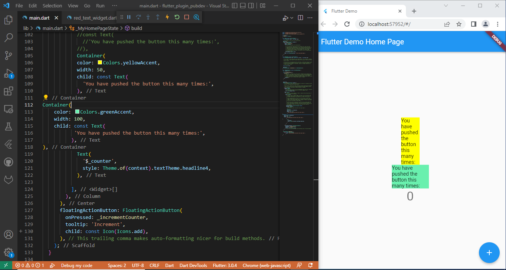

# flutter_plugin_pubdev
# Baggio Deroger

Praktikum steps:

1. Using plugins:

2. In step 2, the command line "flutter pub add auto_size_text" is used to install auto_size_text by adding the package directly to the application. It will allow the program to adjust screen size in order to give a more adaptive user experience.

3. The first line in step 5 is to initialize the variable "text" that is a String type, it also is a final variable which means that its value cannot be changed after t has been intialized. The second line is to declare the two optional named parameters, the first "key" with type Key and the second one text with the type of field this.text which initializes this.text with the passed value. ":" starts the initializer list which allows us to execute expressions before it is forwarded to the constructor's superclass. "super(key: key)" forwards to the constructor of the super class and passes the parameter key passed to RedTextWidget to the super constructors key parameter (same as for RedTextWidget({Key? key})).

4. The first widget is a widget container that calls the constructor parameter to pass the value into the variable. It is used to specify the style of the container which is shown as the yellow box on the screen.On the other hand, the second widget uses a Text constructor class from Text class. The style of the two containers are different, as shown on the final output.

5. Explanation:
text:               it is there to the key for the resulting Text widget.
style parameter:    defines the style used for the text widget which is colored red and the size of the font is 14.
maxLines parameter: It is set at 2, which means that the number of lines for the text can be more than 2.
overflow parameter: The visual overflow for the text widget will have an ellipsis effect.
